<h1 align= "center"> Fast Food Order 15 (FF15) Web Application </h1>
<br/>
<br/>
<br/>

<p align="center">
Pham Le Hoang Duy (17590) (Team Leader) <br/>
Hoang An (15693) <br/>
Vo Dang Khoa (18955) <br/>
Nguyen Phan Truc Ly (16580) <br/>
Truong Nguyen Thien An (15890) <br/>


<br/>
<br/>
<br/>
<br/>

<p align= "center">
Course: Programming Exercise <br/>
Lecturer: Huynh Trung Hieu <br/>
Due Date: 22nd May, 2023 <br/>
</p>
<br/>
<br/>

--------------------------------

# 1. Acknowledgements <a name="acknowledgements"> </a>

<br/>
<p align="right">
Pham Le Hoang Duy <br/>
Team 3 <br/>
Class: Programming Exercise <br/>
Vietnamese German University <br/>

Pro. Huynh Trung Hieu
Vietnamese German University
<br/>

Dear Prof. Huynh Trung Hieu,
Please find below our reports on Fast Food Order 15, which is part of the subject Programming Exercise.

This report gives you information about the inner workings of the project from overviews and software design perspective while providing an easy-to-understand diagram, and also further information about pros and cons of the project.
Thank you for tanking the time to read this report and I hope it meets with your approval. If you have any questions, please do not hesitate contact me by email: anhoangvgu3011@gmail.com.
<br/>
<br/>
Sincerely yours,
<br/>
Pham Le Hoang Duy
<br/>
Team leader.
<br/>

--------------------------------

# 2. Abstraction <a name="abstraction"> </a>

The FF15 is web application built using PHP for backend and using CSS,React, Typescript for frontend with some modern libraries to pro a graphical user interface.

*Key word: Web application, PHP, React, Typescript.*

--------------------------------

# Table of content

1. [Acknowledgements](#acknowledgements)
2. [Abstraction](#abstraction)
3. [Introduction](#Introduction) <br/>
    3.1 [Purpose](#purpose) <br/>
    3.2 [Audience](#audience) <br/>
    3.3 [Constain](#constain) <br/>
    3.4 [Team Members Tasks](#task) <br/>
    3.5 [Scrum Review](#scrumReview) <br/>
        3.5.1 [Report](#report) <br/>
        3.5.2 [Retrospective](#retrospective) <br/>
4. [Project Overview](#projectOverview) <br/>
    4.1 [Overview Architecture](#OverviewArchitecture) <br/>
    4.2 [Brief Description of Client-Server Architecture](#briefDescription) <br/>
    4.3 [Product Backlog](#productBacklog) <br/>
    4.4 [Usecase Diagrams](#usecaseDiagrams) <br/>
    4.5 [ER Diagrams](#erDiagrams) <br/>
    4.6 [Class Diagrams](#classDiagrams) <br/>
    4.7 [Activity Diagrams](#activityDiagrams) <br/>
5. [Software Architecture](#software) <br/>
    5.1 [Server Runtimes](#serverRuntimes) <br/>
    5.2 [Database](#database) <br/>
    5.3 [Backend Software](#backend) <br/>
    5.4 [Deployment Framework](#deployment) <br/>
    5.5 [Software functions](#softwareFunctions) <br/>
        5.5.1 [Registration function](#registrationFunction) <br/>
        5.5.2 [Login function](#loginFunction) <br/>
        5.5.3 [Logout function](#logoutFunction) <br/>
        5.5.4 [Add cart function](#addcart) <br/>
        5.5.5 [Cart function](#cart) <br/>
        5.5.6 [Checkout function](#checkout) <br/>
        5.5.7 [Search function](#search) <br/>
        5.5.8 [Update Profile function](#update_profile) <br/>
        5.5.9 [Update Adress function](#update_address) <br/>
    5.6 [Administrator management](#adminFunciton) <br/>
        5.6.1 [Admin Interface](#adminInterface) <br/>
        5.6.2 [Backend Management](#adminBackend) <br/>
6. [User manual](#userManual) <br/>
    6.1 [How to use the web application](#using) <br/>
    6.1.1 [User registration](#userRegistration) <br/>
    6.1.2 [User login](#userLogin) <br/>
    6.1.3 [User logout](#userLogout) <br/>
    6.1.4 [User choose the food](#userchooseFood) <br/>
    6.1.5 [User choose the drink](#userchooseDrink) <br/>
    6.1.6 [User reviewing order](#ReviewOrder) <br/>
7. [Conclusion](#conclusion) <br/>
   7.1 [Limitation](#limits) <br/>
   7.2 [Learning](#learning) <br/>
   7.3 [Future Development](#future) <br/>
8. [Appendix A: Glossary of Terms](#appendixA)
9. [Appendix B: Gantt Chart](#appendixB)

--------------------------------

# 3. Introduction <a name="introduction"> </a>

## 3.1 Purpose <a name="purpose"> </a>

We are FF15 (Fast Food Order 15), a software that focuses on developing applications for users, typically for user searching for the ease of order food while staying at distance places, to avoid the needed of waiting at a restaurant. FF15 resembles other assessment websites such as shopeefood.com, mcdonald.com, etc.
However, we improve the styles and usability of the food order so that they are personalized and customized for admins and users.

## 3.2 Audience <a name="audience"> </a>

The report is for the instructor's review to determine our grade for the Programming Exercise course.

## 3.3 Project scope <a name="projectScope"> </a>

The report has been written to familiarize the audience with the features of the program while presenting the schedule and progress of the project.
A detailed explanation of the frameworks used and the application and functions are not included in this report. To mark this project as a success, we have to achieve the following requirements:

This application has 2 interfaces:

- User Interface
- Admin Interface

Users after registration can:

- View the food and drink that is appear on our application.
- Order the food and drink.
- View the meal which is the combination of the food and drink that they have choose.
- Check the meal they have ordered and confirmed the meal.

Admin of this application can:

- View all User's Order.
- View all User's Order Details and 

## 3.4 Team member position <a name="task"> </a>

| Team | Member |
| --- | --- |
| DevOps | Pham Le Hoang Duy (Team leader) |
| User Interface Design | Hoang An |
|                       | Truong Nguyen Thien An |
| Front end developer   | Hoang An (Lead FrontEnd) |
|                       | Truong Nguyen Thien An |
| Backend Developer     | Pham Le Hoang Duy (Lead BackEnd)|
|                       | Vo Dang Khoa |
|                       | Nguyen Phan Truc Ly |
| Documentation and report| Hoang An (Lead Documentation)|
|                       | Pham Le Hoang Duy |
|                       | Vo Dang Khoa |
|                       | Nguyen Phan Truc Ly |

## 3.5 Scrum Review <a name="scrumReview"></a>

### 3.5.1 Retrospective <a name="retrospective"> </a>

#### 3.5.1a Sprint 1

After the day the project is assigned, we discussed and distribute tasks for each member to complete.Thus, we arranged 2 meetings weekly in order to review progress and keep track of the work.
**Current requirements:**

- Analyze requirements and select Architecture.
- Draw diagram for the project and write Product Backlog.
- Upload information into Gitlab and write proposal.
- UI Wireframes sketchs and design.
- Build Front-End Architecture and Init Code Base.

**Achievement:**

- We analyzed and illustrated how will the user service work and were able to assign tasks for members depending on their field of knowledge.
- We discussed and had agreements in the general functions and classes in the diagram.
- We decided to use Notion for managing and updating our work, Gitlab for building and storing material of application, and Messenger for online discussion during remote working.
- We also sketches and design the User Interface for the application and build Architecture and Init Code Base.
- We made plans for the next period of time as well as assigned work for each individual.

#### 3.5.1b Sprint 2

We had 3 meetings weekly to check our process as well as speed up to have extra time for reconsidering.
**Current requirements:**

- Build Database class and Database Exam.
- Create and code the front-end layout.
- Write the Food Order Usecase.
- Build Multi-level Transaction Management.
- Build the Food and Drink order.
- Create and write API.
- Build the Middleware.

**Achievement:**

- We accomplished the assigned tasks in Sprint 2.
- We made some preparation for the Final Documentation.
- We separated the task and work together to code Frontend Layout.
- We focused on build the Back-end and Front End function.
- We made plans for the next period of time as well as assigned work for each individual.

#### 3.5.1c Sprint 3

We had 3 meetings weekly to check our process as well as speed up to have extra time for reconsidering and working to complete the project.
**Current requirements:**

- Fetch database.
- Do the admin management UI and Functions.
- Complete tasks for Backend.
- Write the final document and slide for presentation.
- Deployment the web application.
- Review all the document and the project's code.

**Achievement:**

- We finished all the requirements.
- We had our Documentation done and had some modification.
- We successfully deployed the project to the website.

--------------------------------

# 4. Project Overview <a name="projectOverview"> </a>

## 4.1 Overview Architecture <a name= "OverviewArchitecture"> </a>

The Fast Food Order 15 project is created under a Client-Server architecture for a web application.

In server-client architecture, the server is responsible for providing services or resources, while the client requests and uses those services. This architecture applies to food order web applications as follows:

The server handles the back-end functionality of the application, such as storing and managing orders and menus, processing payments, and communicating with external APIs.
The client is the user-facing part of the application, typically implemented as a web browser or mobile app, that sends requests to the server and receives responses.
When a user wants to place a food order, they use the client to interact with the application. They might browse the menu, select items, and enter delivery or payment details. The client then sends this information to the server, which processes the order and sends a response back to the client indicating whether the order was successful or not.

This architecture allows for scalability and security because the server can handle multiple requests from clients simultaneously and can centrally manage data and business logic. Meanwhile, clients can be lightweight and focused on delivering a great user experience without being bogged down by backend tasks.

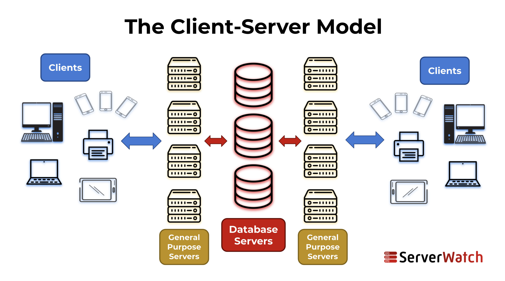

<p align= "center"> Overall Architecture </p>

## 4.2 Brief Description of Pipe and Filters Architecture <a name="briefDescription"> </a>

In a food order web application, pipes and filters can be used as a technique for processing data. In this architecture, data is passed through a series of processing steps called filters, which are connected by pipes. A pipe is a communication channel that connects the output of one filter to the input of another.

For example, in a food order web application, the user might select a menu item and enter special instructions. The order information is then sent to the server, where a series of filters process the data before it's delivered to the kitchen for preparation. Here's an example of how pipes and filters could be used:

A "menu filter" first validates that the selected item is on the menu and available for ordering.

An "options filter" checks if there are any special instructions accompanying the order and ensures they're valid.

A "payment filter" processes the payment information and verifies that the transaction is successful.

Finally, a "delivery filter" confirms delivery details and sends the order to the kitchen for preparation.

Each filter performs a specific task and relies on the previous filter's output, enabling modular design and code reuse. This architecture can help improve maintainability, scalability, and extensibility of the application. By breaking down the overall processing into smaller self-contained pieces, we can also more easily test individual components and adapt or modify the pipeline as needed.

One of the main goals of using the Pipe and Filters pattern in this context is to improve the scalability and maintainability of the application by breaking down complex processing tasks into smaller, independent components. In this pattern, each component (filter) performs a specific task on the data that flows through the system (the pipe). By having these components work in a modular and independent way, it becomes easier to modify, optimize or replace specific parts of the system without affecting other parts.

It should have the following characteristics:

- Scalability
- Reliability to handle errors by isolating them to specific filters without affecting the entire system
- Flexible and dynamic configuration of the processing pipeline on the fly
- Efficiency by allowing independent filters to run concurrently on different servers or threads
- Maintainability without affecting other parts of the system
Overall, the Pipe and Filters pattern's characteristics make it an excellent choice for a client-server architecture, as it provides scalability, reliability, flexibility, efficiency, and maintainability.


<p align= "center"> System: Pipe and Filters </p>

## 4.3 Product Backlog <a name="productBacklog"> </a>

Product Backlog is the Master Board for teams **(Frontend, Backend)** to find the users’ demands. Each story will be picked for Sprint circle in order based on its priority and score. There are 2 types of user:

| Users | Note |
| --- | --- |
| Admin | [A] |
| Customer | [S] |

| User Stories | Score | Priority (Top: 5 → Bottom: 1) |
| --- | --- | --- |
| [C] I want register and make an order.  | 2 | 5 |
| [A] I want to manage all the data of the items on the menu. | 2 | 5 |
| [A] I want to manage all the customer’s data. | 1.5 | 5 |
| [A] I want to be able to assign category to an item. | 1.5 | 5 |
| [A] I want to change the payment status of the customer’s order. | 1.5 | 4 |
| [C] I want to view what I have added in my cart. | 1.5 | 4 |
| [C] I want to check out the order that I have made | 1.5 | 4 |
| [C] I want to view my orders history and its information. | 1 | 3 |
| [A] I want to view user orders so that I can send it to the chef| 1 | 3 |
| [C] I want to view the latest items on the menu| 1 | 2 |


## 4.4 Usecase Diagrams <a name= "usecaseDiagrams"> </a>

At first, it is obvious that users have 2 fundamental services, which are login and ordering the food or drink. In the login system, users can choose to register if they do not have an account or forget a password if they lose their account. Meanwhile, in the order system, users can order food, drink immediately and view their order afterward.

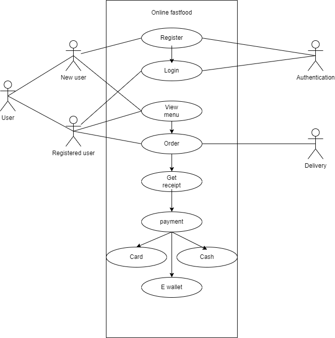
<p align= "center"> User use case diagram</p>

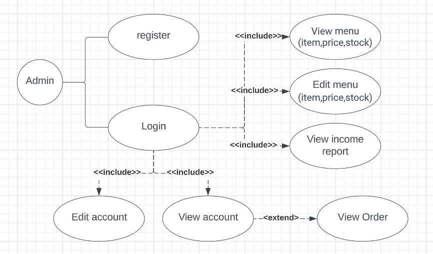
<p align= "center"> Admin use case diagram</p>

## 4.5 ER Diagrams <a name="erDiagrams"> </a>

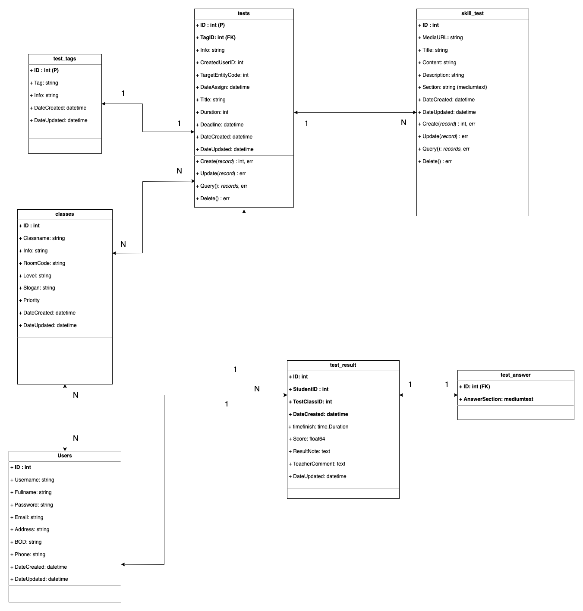
<p align= "center"> ER diagram</p>

## 4.6 Class Diagrams <a name="classDiagrams"> </a>

Realizing the basic rule of a web application, which is user-oriented. Standing from the user’s story, we use basic role-based operation for defining user and admin. It is clear to see that classes and users share a common appointment class, which can simplify the whole system. Although our approach is not unique and still has some limitations, the lightweight system is a necessary method to implement and fulfill the requirement of the project.


<p align= "center"> User class diagram relationship</p>

## 4.7 Activity Diagrams <a name="activityDiagrams"> </a>

The activity diagram illustrates the basic flow for client when accessing to our web application. Our main concentration is on the doing the test function, therefore, we try to split the operation into details.

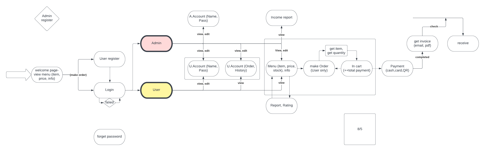
<p align= "center"> User activity diagram</p>

While, the activity diagram of administration illustrates the basic flow for admin when controlling to the database and web application. Our main concentration is not only on the querying operations (View, delete, update), but admin can also assign test to a group of students and view the performance of them.

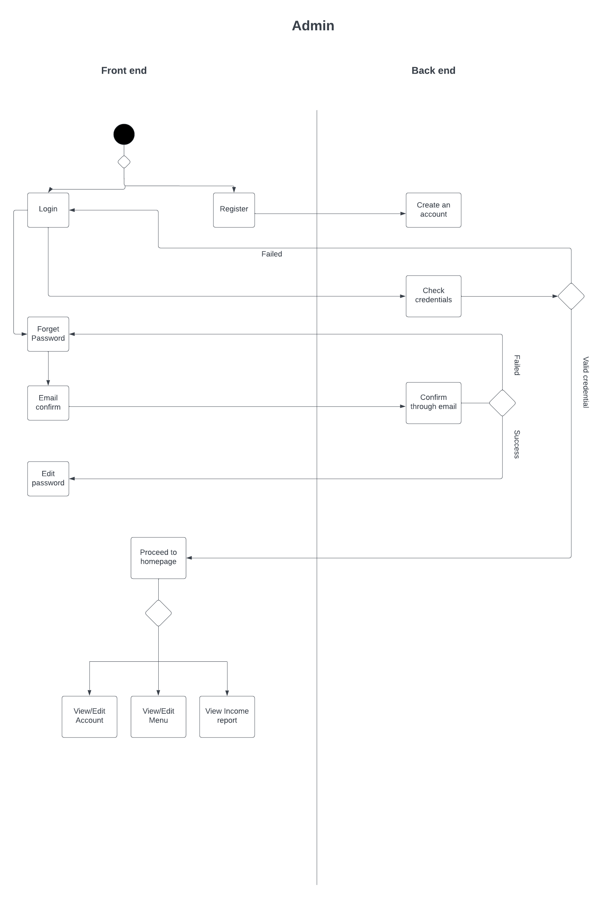
<p align= "center"> Admin activity diagram</p>

--------------------------------

# 5. Software Architecture <a name="softwareArchitecture"> </a>

## 5.1 Server runtimes <a name="serverRuntimes"> </a>

The website runs on the XAMPP which is a free and open-source cross-platform web server solution stack package developed by Apache Friends, consisting mainly of the Apache HTTP Server, MariaDB database, and interpreters for scripts written in the PHP and Perl programming languages. We determine to use XAMPP of some obvious advantages such as the ease at which a WAMP or LAMP webserver stack can be deployed and instantiated, some common packaged applications that could be easily installed and XAMPP also provides support for creating and manipulating databases.

## 5.2 Database <a name="database"> </a>

Our database is MariaDB 10.4.27, a very basic option due to reasons:

- MariaDB is easy to use on for its basic query syntax.

- MariaDB is already included with XAMPP so it is so much easier and faster

- MariaDB on overall in cheaper in comparison to PostgreSQL.
We design our database to take advantages of MariaDB, which is relationship and constraints across schema. For example, we always indexing the primary key and reference foreign keys whenever possible to maintain the consistency of data.


## 5.3 Backend Implementation<a name="backendSoftware"> </a>

### PHP
For backend, we implement it with PHP. There are several reasons why we choose PHP as our main server-side language:
•	many available specialists.
•	a large base of reference and educational materials.
•	better loading speed of websites.
•	more options for database connectivity.
•	a large collection of open-source addons;
•	inexpensive website hosting.
•	great synergy with HTML.
•	excellent flexibility and combinability.
•	various benefits provided by cloud solutions.


### Docker-compose

We use docker-compose to manage our services. The docker-compose.yml file in our Digital Ocean droplets is showned below:

```yml
version: "3"

services:
        api:
                env_file: /root/source.list
                container_name: vgu-api
                restart: always
                image: registry.digitalocean.com/gl-prod/vgu-api:${TAG}
                ports:
                        - "8080:8080"

        ui:
                restart: always
                image: registry.digitalocean.com/gl-prod/vgu-ui:${TAG}
                container_name: vgu-ui
                ports:
                        - "5001:80"
                depends_on:
                        - api

volumes:
        my-db:
```

## 5.5 Software function <a name="userInterfaces"> </a>

### 5.5.1 Registration function <a name="registrationFunction"> </a>

Users who have not yet registered will not be able to log in and use any other function that the website provide. They must first register by clicking the Register button. The application also allows resetting the password for existing users in the database. All the passwords for the user will be hashed and saved in the database using the "SHA-1" hashing function. It’s a slow algorithm. This characteristic made it useful for storing password hashes as it slows down brute force attacks. Not only it can be used to compare files or codes to identify unintentional only corruptions but also It can be used to compare files or codes to identify unintentional only corruptions. 

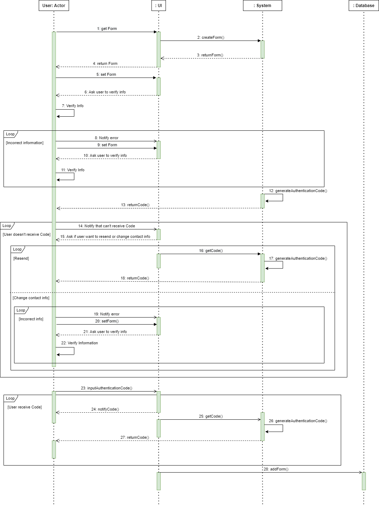
<p align= "center"> Sequence diagram represents registration function</p>

### 5.5.2 Login function <a name="loginFunction"> </a>

It contains two text fields - one for entering a login email and one for entering a password - and a command button that initiates password verification. If either of the text fields is left blank, this is an error that should be communicated to the user. If both fields are filled in, but there is no entry for the mail or the password is incorrect, this must also be communicated to the user.

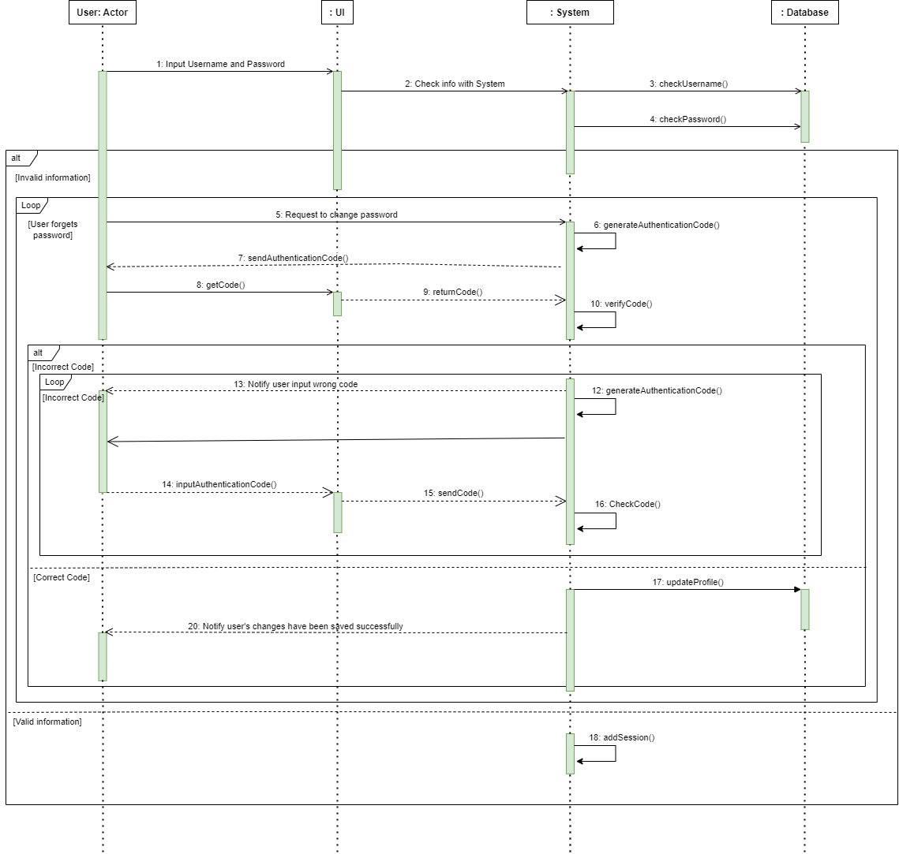
<p align= "center"> Sequence diagram represents login function</p>

### 5.5.3 Logout function <a name="logoutFunction"> </a>

In case the user has already done this session and wants to log out, the system will notify by the alert box with the warning message. If the user confirms an ending session, the system will end the session immediately.

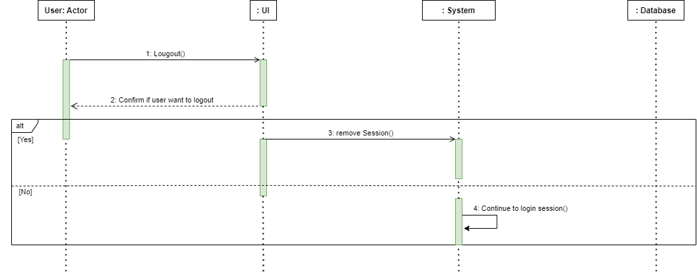
<p align= "center"> Sequence diagram represents logout function</p>

### 5.5.4 Add cart function <a name="addcart"> </a>
After login, the user will be able to add any product that they want to the cart. User can choose the amount of the product and if user change their mind, they can also adjust the amount or delete with later function.


### 5.5.5 Cart function <a name="cart"> </a>
**CONTEXT:**
Cart page is used for managing information about the products, including:
- image: the image of the product that the admin adds to make the user easier to know what the product look like
- name: the name of the product
- price: the price of the product that the user adds to the cart. With this, we can know the “sub-total” of that single product and the “grand-total” of all the products in the cart.
- quantity: the amount of the single product that the user adds
- sub-total: the total amount of money that it cost for that quantity of single product
- grand-total: the total amount of money it cost for all the product that the user has in the cart.
**FUNCTIONS:**
- delete: it is used to delete single product that the use adds to the cart
- delete_all: it is used to delete all the product from the cart
- update_qty: it is used to update the amount of single product that the user wants
- checkout: it is used to proceed to the checkout page which the user can use to finish their order
- continue shopping: it is used to go back to the main menu and resume the shopping process for the user
**COMPONENTS:**
- connectbd: connect to the Database and access its data. Whenever the user adjusts the product’s quantity or delete something, it will send back to the database
- user_header: on top of the page will be the header so that it is easier for user to access others page of the website
- footer: at the bottom of the page to provide the website email, opening hours, address via google maps, contact number for the user locate or contact the restaurant if they want

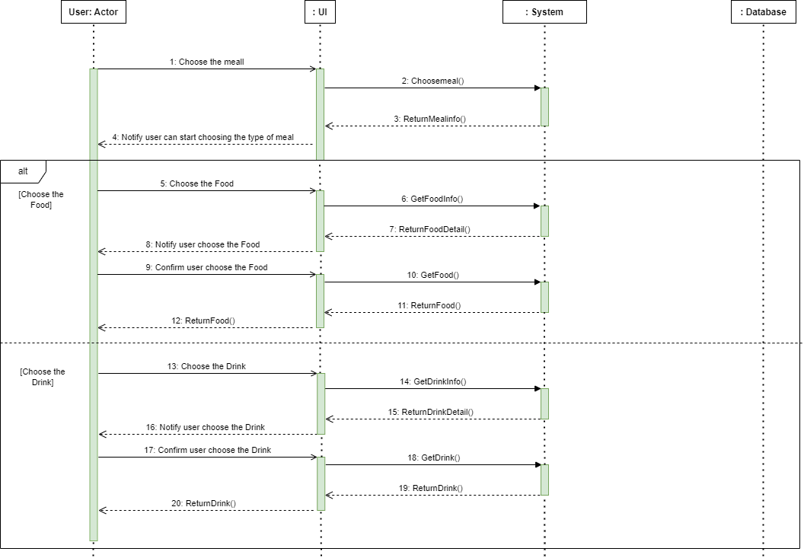
<p align= "center"> Sequence diagram represents carrt function</p>

### 5.5.6 Checkout function <a name="checkout"> </a>
**CONTEXT:**
Check out page is the final step before the user submit the order so in this page we will have:
- order summary: all the information of the items in the cart like the quantity, its price.
- grand-total: the total money that the user has to pay for all the items in the order
- your info: user personal profile such as user’s full name, phone number, email.
- delivery address: user’s chosen address that they want the restaurant to delivery to
**FUNCTIONS:**
- view cart: if the user changes their mind and want to change something, user can use this function to go back to the cart section and adjust it.
- update info: if the info is wrong anywhere or the user just want to change something, they can use this function to go to update info page 
- update address: this part is quite important, so the user must check carefully before submitting the order so if user want to change address they can use this function
- payment method: with this function, user can choose the way that they want to pay for the order via cash, credit card, online banking and momo
- place order: this function is to submit the order after user have done checking all the items in the cart and they information. When use this function, all the data is pushed on to the database and it will appear on the admin panel.
**COMPONENTS:**
- connectbd: connect to the Database and access its data. Whenever the user adjusts the product’s quantity or delete something, it will send back to the database.
- user_header: on top of the page will be the header so that it is easier for user to access others page of the website
- footer: at the bottom of the page to provide the website email, opening hours, address via google maps, contact number for the user locate or contact the restaurant if they want

### 5.5.7 search function <a name="search"> </a>
User can use this search bar to find the items that they want. If the data from the database has the name of that wanted item, it will be showed on the page and if not, it will show a signal that the items user search for have not added.

### 5.5.8 update_profile function <a name="update_profile"> </a>
The moment user register for this website, it asks for their information such as full name, phone number and email so that the restaurant can know and contact them if the order is done or there are any troubles. After the register, if user find that their information is wrong or they just want to change, user can use this to change their profile.

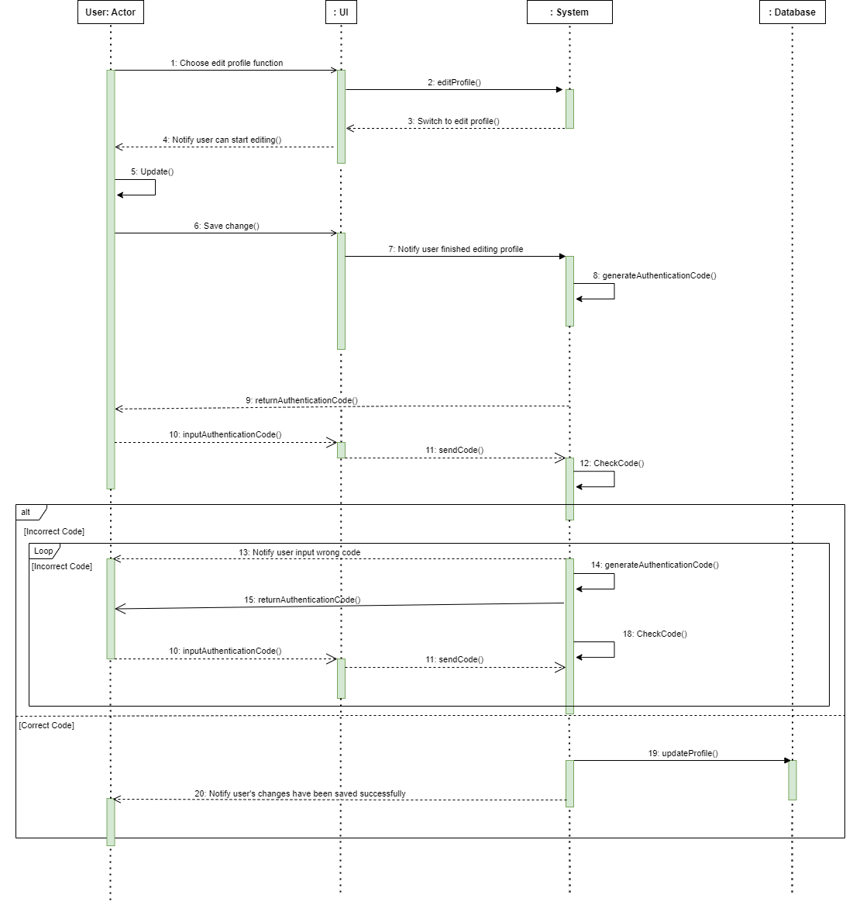
<p align= "center"> Sequence diagram represents edit profile function</p>

### 5.5.9 update_address function <a name="update_address"> </a>
When user first register for this website, it just asks for their information like full name, phone number and email. But the moment user makes an order, that when the website ask for the address so that the restaurant can keep track and deliver to user’s destination. So user can use this to add or update their address


## 5.6 Administrator management <a name="adminManager"> </a>

The administrator of the server is defined statically before the server starts. The admin is a user inside of the database. 
The admin can only use the administration controller

### 5.6.1 Admin Interface <a name="adminInterface"> </a>

After authentication as the admin, the admin will see the following interface:

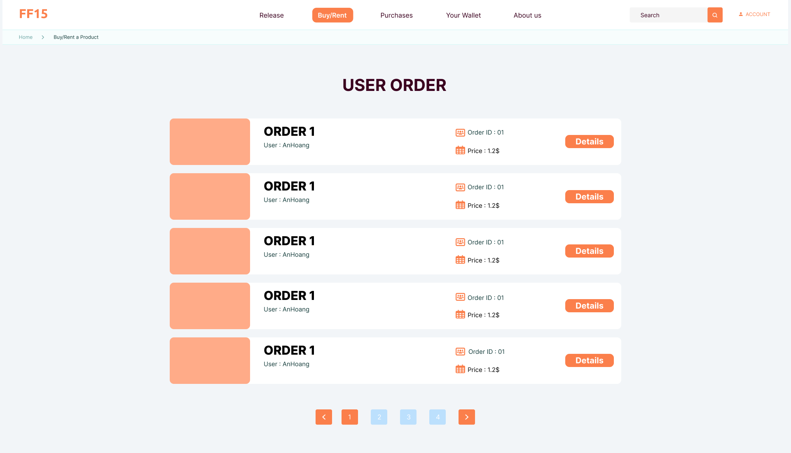
<p align= "center"> Order management interface </p>


<p align= "center"> User management interface </p>

### 5.6.2 Backend Management <a name="backendManager"> </a>

<!-- Add content of the backend management(API) -->
Admin Backend Management functionalities should be implemented so that the admin can control all the entities inside the application including Category, Products and Orders. Overall, Admin has access to all [GET] methods which shows the application information. In details:
- **For Category**: there are APIs to GET all category in the database. Admin can ADD/DELETE/EDIT a category from the application. 
- **For Products**: there are APIs to CHOOSE FILE/ADD/DELETE/EDIT a product. Moreover, admin can manage old and new products from their category, name, image to price.
- **For Order**: there are APIs to UPDATE/DELETE an order. UPDATE the payment status of an order so that the admin can know that the order is done or not. DELETE the order when there is happen to be an error somewhere
For other entities such as **User’s Profile**, **User’s Address**,**User’s Cart** admins are not allow to access and edit those, as their consistency are strictly managed by the application.


--------------------------------

# 6. User manual <a name="userManual"> </a>

## 6.1 How to use the web application <a name="howToUse"> </a>

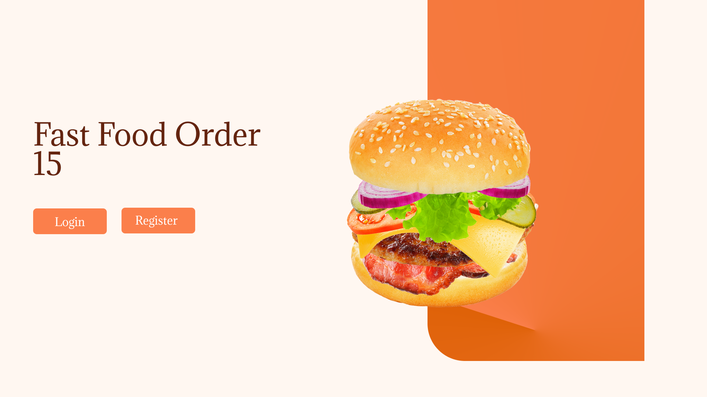
<p align= "center"> Landing page layout</p>

### 6.1.1 User registration <a name="userRegistration"> </a>

**Basic flow:**
Precondition: User should be able to access internet.

This describes the steps:

1. On the landing page, the user can see the "Signup" button on the navigation bar, click on the "Sign up button".
2. The user should fill in the box in the registration form. (Full name, Username, Password, Email, and select the Gender)
3. The user submits the registration form, and clicks the "Create Account" button.
4. If the account hasn't existed, a new account has been created. The system will be notified by the alert box on the top and automatically navigate the web browser to the login page.

Postcondition: The user has a registered account for future purposes.

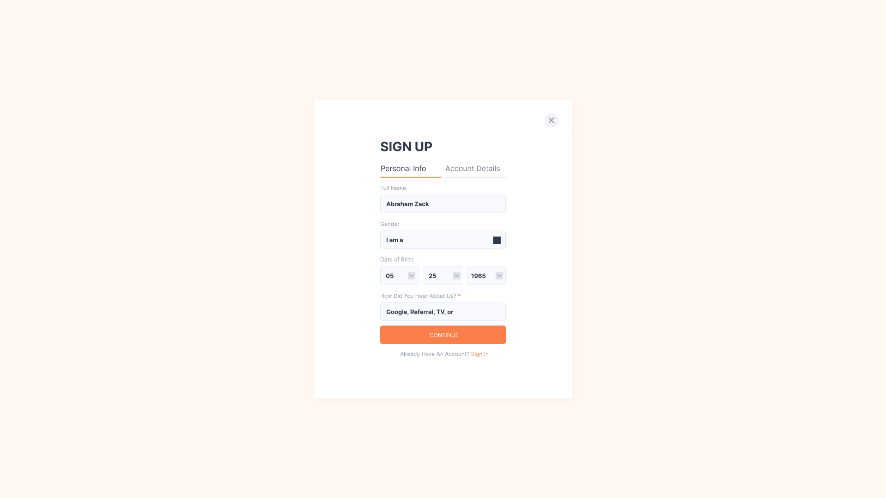
<p align= "center"> Registration page</p>

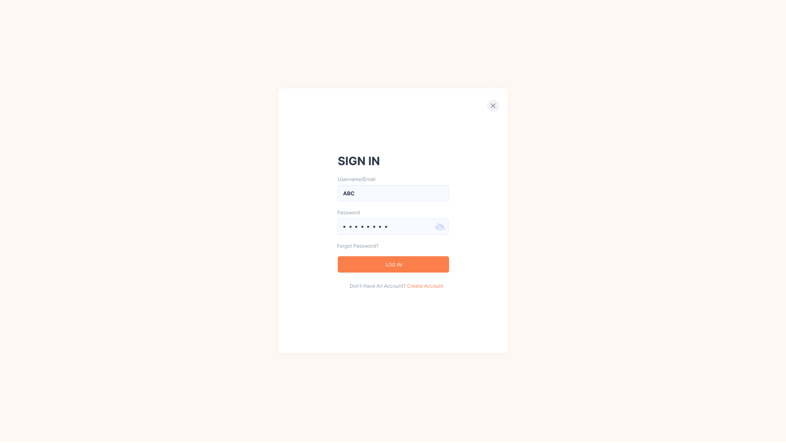
<p align= "center"> Register successfully</p>

**Note: If user don't fill in fully the registration form, the system will notify**

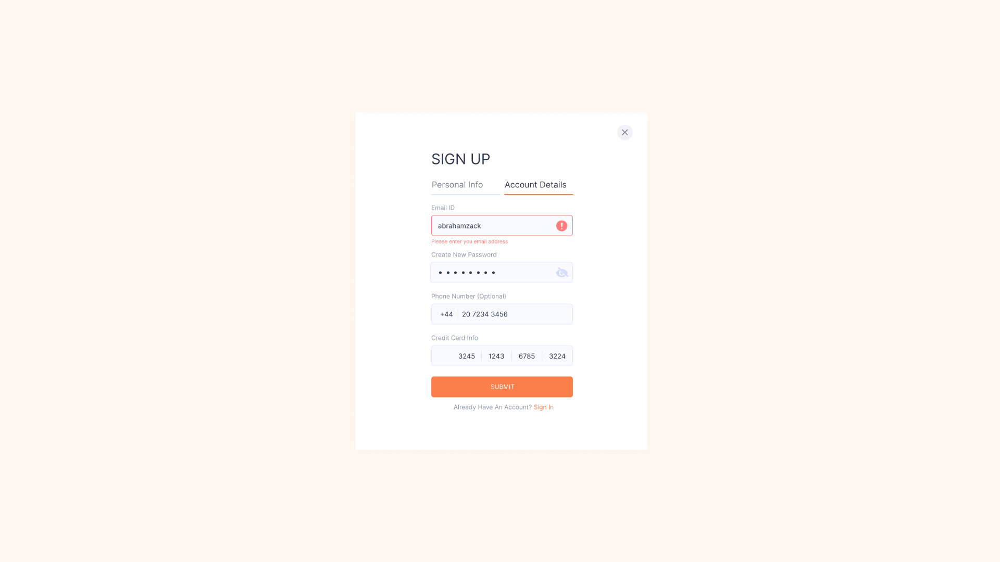
<p align= "center"> Warning message</p>

### 6.1.2 User login <a name="userLogin"> </a>

**Basic flow:**
Preconditions: User has already registered in the system.

This describes the steps:

1. On the landing page, the user can see the "Sign in" button on the navigation bar and clicks on the "Sign in button" to sign in.
2. The user enters the username and password.
3. The system accepts username and password.
4. The user successfully logged into the website and automatically navigate to the user profile.

Postconditions: The user is able to utilize the function of the service.


<p align= "center"> Login page</p>

### 6.1.3 User logout <a name="userLogout"> </a>

**Basic flow:**
Preconditions: The user has an account being logged in the system.

This describes the steps:

1. If The user clicks on the "User" button on the navigation bar, it will be dropped down. The button will be shown "Profile" and "Log out", so click on the "Log out" button.
2. The system asks for sign-out confirmation.
3. The system will be logged out and ended the session, meanwhile, it also automatically back to a Landing page.

Postcondition: The user signs out successfully.


<p align= "center"> Logout function</p>

### 6.1.4 User choose the food <a name="userchooseFood"> </a>

**Basic flow:**
Precondition: The user is logged in.

This describes the steps:

1. User can find the food they want by clicking on the "Food" button on the navigation bar.
2. The system will change to the ChooseFood page and show out all food that is avaiable. It also shows the food's information.
3. User click on the "add to packet" button to add the food.

Postcondition: The user add the food to packet.

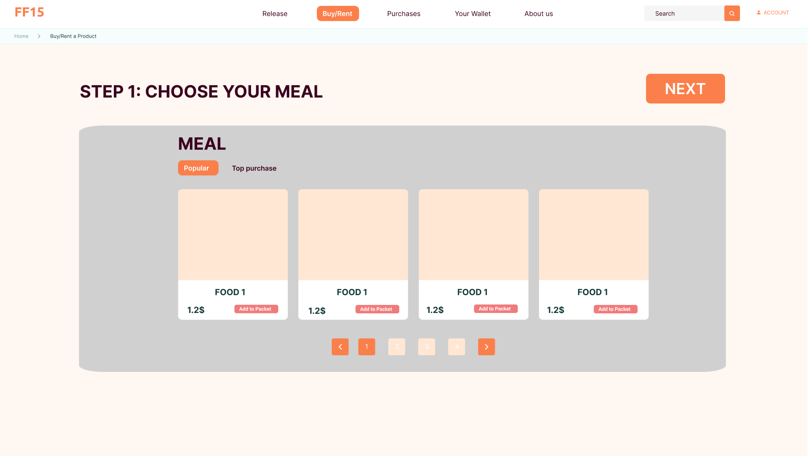
<p align= "center"> Class layout</p>

### 6.1.5 User choose the drink <a name="userchooseDrink"> </a>

**Basic flow:**
Preconditions: The user had choose the food succesfully.

This describes the steps:

1. The user clicks on the "confirm" button on the Food tag.
2. The user can see Drink that has been listed by the system
3. The system will change from the "Food" page to the "Drink" page so that the user can choose the drink.
4. The system notifies the drink has been choose succesfully.
5. The system change from "Drink" page to "Succesfully Order" page and return the order's ID

Postcondition: The user add the drink to packet.

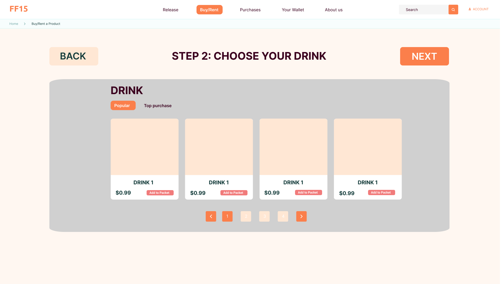
<p align= "center"> Choose the Drink layout</p>

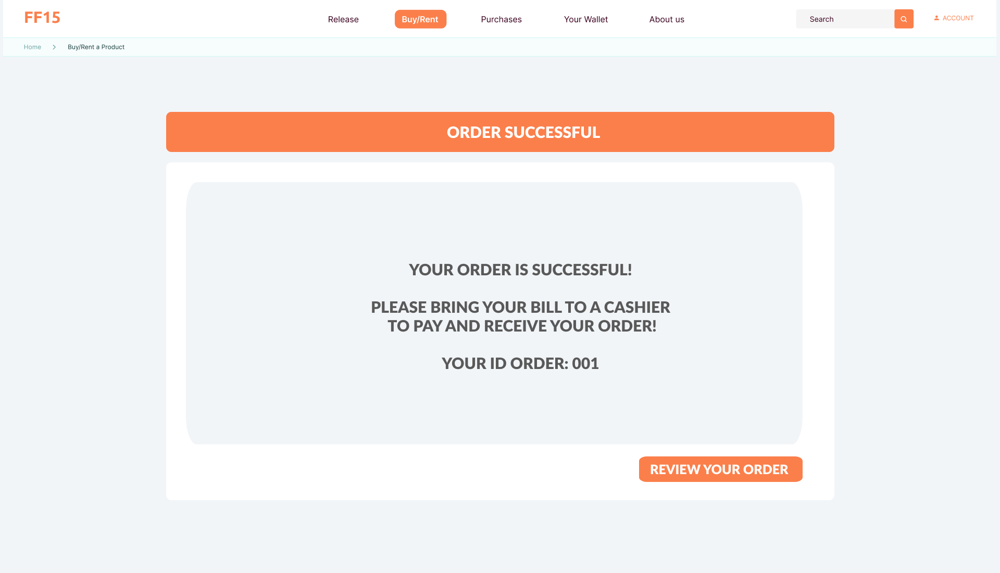
<p align= "center"> Successfully Order layout</p>

### 6.1.6 Reviewing the Order <a name="ReviewOrder"> </a>

Precondition: The user review their order.
**Basic flow:**
This describes the steps:

1. The user had completed choose the Drink and Food, and added its to their packet
2. The user can review the order that they had make by choosing "Review Order" button on the "Succesfully Order" page
3. In the "Review Order" page, the user can see the Food and Drink that they had pick.
4. The system return the user order's ID at the top right of the "Review" page.

Postcondition: The system show out the order and order's ID.

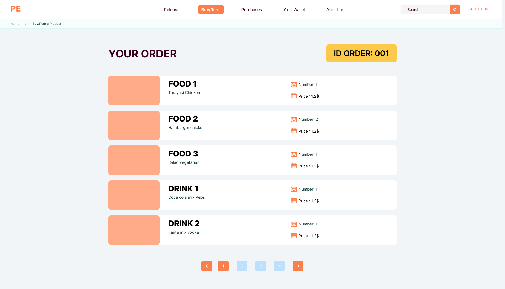
<p align= "center"> Order Review interface</p>


--------------------------------

# 7. Conclusion <a name="conclusion"> </a>

## 7.1 Limitation <a name="limitation"> </a>

During our time working as a team, we encountered the following back draws:

- Lack of time in working.
- Miscommunication between team members.
- Minor bugs in coding.

The project is expected to be completed in 8 weeks. Progress is documented below. The process has been very smooth, with only minor setbacks along the way. However, we believe that there is room for improvement in this project. With an extended deadline, the project can become a full-fledged website application.

## 7.2 Learning <a name="learning"> </a>

By the time of writing this report, growing is just a process not only as individuals but also as a team. Having different inputs on how to face adversity and work together as a team, we have learned to be more flexible, think outside the box, and deal with argumentative situations. Particularly, we always keep updating the project to discover the limitations, fix the bugs, and enhance specific functions of the web application. Hence, it is very important to be open to sharing experiences and receiving comments from the community.

## 7.3 Future Development <a name="future"> </a>

We truly believe in the key to development lies in the constant update in technology and system design. Clean architecture is the key to a better development process. We are also looking forward to the future development of the project.

--------------------------------

[1]: <https://www.ibm.com/cloud/learn/three-tier-architecture> "Three-tier Architect"
[2]: <https://www.techtarget.com/whatis/definition/clean-architecture> "Clean Architecture of Uncle Bob"

# 8. Appendix A: Glossary of Terms <a name="appendixA"> </a>

| Abbreviation | Name |
| --- | --- |
| API | Application Programming Interface |
| ID | Identification |
| SQL | Structured Query Language |
| JSON | JavaScript Object Notation |

--------------------------------

# 9. Appendix B <a name="appendixB"> </a>

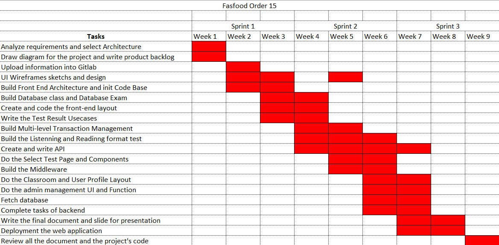
<p align= "center"> Project Gantt Chart</p>
